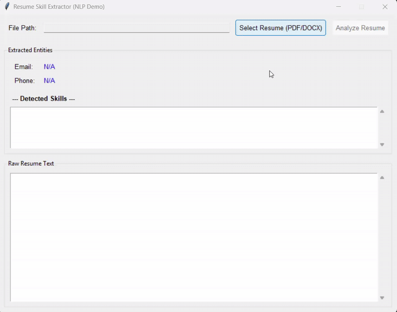

Resume Skill Extractor (NLP): Automated Screening Tool

A standalone, multi-threaded Python desktop application designed to automate the parsing, analysis, and extraction of key entities—Technical Skills, Email, and Phone—from structured and unstructured resume files (PDF, DOCX, TXT).

This project demonstrates expertise in Natural Language Processing (NLP), asynchronous application design, and advanced deployment strategies for Python-based NLP tools.

Features & Technical Highlights

1. Robust Text Extraction
Safely reads and extracts text from diverse resume formats:

PDF: pdfplumber

DOCX: docx2txt

TXT: plain text

2. NLP Entity Recognition
Uses spaCy (en_core_web_sm) for tokenization and preprocessing, combined with a custom dictionary-based keyword matcher (the TECH_SKILLS list) to detect over 100 domain-specific technical competencies with high reliability.

Technologies Used: spaCy, re, collections

3. Asynchronous GUI
Native desktop interface built with Tkinter.
Time-consuming file reading and NLP processing runs in a background thread (threading.Thread) to maintain responsiveness and prevent GUI freezing.

Technologies Used: tkinter, threading

4. Contact Info Extraction
Optimized Regular Expressions for precise extraction of standard contact fields such as Email and Phone Number.

Technologies Used: re

**Screenshots**

| GUI Interface | Sample Report |
|----------------|----------------|
| 

Installation & Setup
1. Prerequisites

*Python 3.8+

*Windows Only: A C/C++ compiler is required for some dependencies (e.g., lxml or pydantic) used by NLP and file-handling libraries.

Windows Setup for spaCy Dependencies:

*Install Microsoft Visual Studio Build Tools:

*Select Desktop development with C++

Including:

	*MSVC v143 – VS 2022 C++ x64/x86 build tools

	*C++ ATL for latest v143 build tools

	*Windows 11 SDK (10.0.26100.6584)

2. Dependency Installation

It is recommended to use a virtual environment (I have tested it with python 3.12 interpreter) :

# Create and activate virtual environment
python -m venv venv
# Windows
venv\Scripts\activate
# Linux / macOS
source venv/bin/activate

Install required Python packages (Recommended to install spaCy dependencies first):

pip install -r requirements.txt

Install the spaCy language model:

python -m spacy download en_core_web_sm

3. Running the Application

Save the Python script as resume_skills_extractor.py.

Run the application:

python resume_skills_extractor.py

Usage Flow:

1) Click Select Resume to choose a resume file (PDF, DOCX, TXT).

2) Click Analyze Resume to extract skills, email, and phone.

3) View extracted entities and raw text directly in the GUI.

Project Structure
Resume_Builder/
├── resume_skills_extractor.py   # Main application script
├── README.md                    # Project overview and setup
├── requirements.txt             # Python dependencies
└── LICENSE                      # MIT License
icense

This project is licensed under the MIT License - see the LICENSE